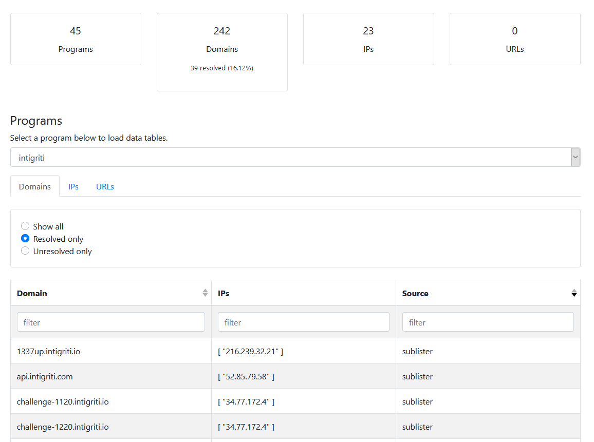

[](https://twitter.com/honoki)

## Introduction

The Bug Bounty Reconnaissance Framework (BBRF) can be used to coordinate your reconnaissance workflows across multiple devices. For more background, read [the original blog post](https://honoki.net/2020/10/08/introducing-bbrf-yet-another-bug-bounty-reconnaissance-framework/).

If you are new to BBRF, you will need to deploy a [BBRF server](https://github.com/honoki/bbrf-server) before you can make use of the client.

### Get started

```bash
# install the client
pip install bbrf

# create the .bbrf folder
mkdir -p ~/.bbrf 

# ensure you have the required configuration in ~/.bbrf/config.json
cat > ~/.bbrf/config.json << EOF
{
    "username": "bbrf",
    "password": "<your secure password>",
    "couchdb": "https://<your-bbrf-server>/bbrf",
    "slack_token": "<a slack token to receive notifications>",
    "discord_webhook": "<your discord webhook if you want one>",
    "ignore_ssl_errors": false
}
EOF
# other optional settings are {"debug":true, "slack_channel": "channel-name", "slack_webhook":"https://..."}

# create a new program
bbrf new test

# or continue with a program you have created before
bbrf use test

# define a scope for your program
bbrf inscope add '*.example.com' '*.sub.example.com' 'example.com'
bbrf outscope add 'blog.example.com' '*.dev.example.com'

# view the program in/out scope
bbrf scope in
bbrf scope out

# start a background listener to listen for changes and send alerts to Slack
# in production, you probably want this continuously running on a VPS somewhere
bbrf listen &

# add some domains manually
bbrf domain add www.example.com example.com some.dev.example.com www.example.com www.example.com thisisnotadomain.example

# note that bbrf automatically safeguards the data quality, e.g.
# it checks the program's in and out scope to see if entries
# should be processed or not, prevents duplicate entries in the database,
# and rejects all input that is not a valid domain
bbrf domains

# add a list of ips from a file by piping into bbrf
cat ips.txt | bbrf ip add -

# run a tool based on the program scope, store results in bbrf,
# and display a list of domains that have been added
bbrf scope in --wildcard --top | subfinder | bbrf domain add - --show-new

# retrieve a raw document from the bbrf server and format with jq
bbrf show www.example.com | jq

# update the outscope
bbrf outscope add www.example.com

# note that this does not automatically remove outscoped domains that
# were already in the database, so you will manually need to fix that!
bbrf domains | bbrf scope filter out | bbrf domain remove -

# discover all features of bbrf on the help page
bbrf -h

# Use dnsx to resolve unresolved domains across all your programs
# and store the results in bbrf, either by updating existing ips and domains,
# or by adding them if they are new
for p in $(bbrf programs); do
  bbrf domains --view unresolved -p $p | \
  dnsx -silent -a -resp | tr -d '[]' | tee \
      >(awk '{print $1":"$2}' | bbrf domain update - -p $p -s dnsx) \
      >(awk '{print $1":"$2}' | bbrf domain add - -p $p -s dnsx) \
      >(awk '{print $2":"$1}' | bbrf ip add - -p $p -s dnsx) \
      >(awk '{print $2":"$1}' | bbrf ip update - -p $p -s dnsx)
done

# view all resolved domains
bbrf domains --view resolved
```

### Python module

To use BBRF in your Python projects, use the interface as follows:

```python
from bbrf import BBRFClient as bbrf

# this will use the system's default ~/.bbrf/config.json file:
programs = bbrf('programs').run()

# to specify a custom configuration, provide a second argument:
conf = {
    "username": "bbrf",
    "password": "<your secure password>",
    "couchdb": "https://<your-instance>/bbrf",
    "slack_token": "<a slack token to receive notifications>",
    "discord_webhook": "<your discord webhook>",
    "ignore_ssl_errors": false
}

domains = bbrf('domains --view resolved', conf).run()
```

### Dashboard

If you like browsing through your recon data with a GUI, you can make use of the [BBRF dashboard](https://github.com/honoki/bbrf-dashboard) on https://bbrf.me. Just plug in your server URL, username and password, and the dashboard will pull your data and make it searchable. Note that all communication to the server happens via your browser, so your data remains safe!

[](https://bbrf.me/)

### Advanced

#### Domains

BBRF will accept and store domains in any of the following input formats:

```
<domain>
<domain>:<ip>
<domain>:<ip>,<ip>,...
```

Note that adding the DNS resolutions of a domain in this way does *not* automatically store the IP in the IPs table,
but that domains and ips are logically seperated in the client, which requires you to write your scripts so that they 
handle this distinction appropriately.

```bash
bbrf domain add www.example.com:1.1.1.1
bbrf domain update www.example.com:2.2.2.2,3.3.3.3
bbrf show www.example.com | jq
```

#### IPs

Similarly, you can store hostnames of an IP address by appending one or more domains with a colon:

```
<ip>
<ip>:<domain>
<ip>:<domain>,<domain>,...
```
Again, BBRF will make sure the provided hostnames are valid domain names before storing them, but will not add them to your list of domains for the program, nor does it validate these domains against the defined program scope. Instead, these domains are stored in a `domains` property on the IP document:

```bash
bbrf ip add 1.1.1.1:www.example.com,sub.example.com
bbrf ip update 1.1.1.1:www.google.com,www.apple.com
bbrf show 1.1.1.1 | jq
```

#### URLs
BBRF will help you manage your URLs, and store their hostname, port, status code and content length for you:

```bash
bbrf url add 'https://www.example.com:8443/a' 'http://www.example.com/b' 'http://www.example.com/c 200 1234'
```

Two formats are accepted: `<url>` or `<url> <statuscode> <contentlength>` delimited by spaces.

The `<url>` can be absolute or relative. A relative URL will require the `-d <hostname>` flag to be specified or will be skipped. Whenever the `-d` flag is set, it will compare that with the hostname parsed from the URL, and skip the URL if they do not match.

Relative URLs and URLs that do not specify a scheme (`http://` or `https://`) will always be interpreted with scheme `http://`. If no port is found, ports 80 and 443 will be used as a default depending on the scheme.

The flag `--show-new` will print a list of new and updated URLs if they were added, or if their status code and/or content length were updated respectively:

```bash
cat urls.txt | bbrf url add - --show-new
[UPDATED] https://sub.example.com:8443/b
[NEW] http://www.example.com/a
[NEW] http://www.example.com/c
```

To view a list of stored URLs of your active program, simply use:

```bash
bbrf urls
``` 

Or, to return URLs belonging to a specific host:

```bash
bbrf urls -d www.example.com
``` 

To list URLs across all programs, run:

```bash
bbrf urls --all
```

To print full URLs with the saved query strings:

```bash
bbrf urls --all --with-query
```

#### Services

To store services (i.e. open ports) in BBRF, provide the input formatted as `ip:port` or `ip:port:service`, and manually specify other properties by means of the tagging system (see below for more info about tags), e.g.:

```bash
bbrf service add 127.0.0.1:8443 127.0.0.1:8888 -t hostname:localhost -t protocol:tcp
bbrf service add 127.0.0.1:80:http 127.0.0.1:21:ftp -t hostname:localhost -t protocol:tcp
bbrf service add 127.0.0.1:22:ssh 127.0.0.1:53:domain 127.0.0.1:80 -t scanned:$(date +%s)
```

Note that services can only be stored for an IP address, and *not* as `domain:port` for example. This avoids the complexity of mapping domains to IPs (especially when an IP address maps to more than one domain), while still allowing search operations supported by a mix of default properties and tags:

```bash
# get all known services on port 8443
bbrf services where port is 8443
# return services for which a tag has been manually provided
bbrf services where hostname is localhost
```

#### Tagging and querying

By setting custom properties for the different document types (programs, domains, ips, urls and services), you can specify e.g. the platform a program belongs to or the name of a team member that added a bunch of new domains.

To add tags to documents, specify a `-t key:value` when creating a new domain, ip, url or service, or leave empty to remove the tag:

```bash
# add a custom tag to all domains
cat domains.txt | bbrf domain add - -t added_by:pieter -t from:domains.txt
# create an IP with a custom tag
bbrf ip add 1.2.3.4 -t added_by:pieter
# remove the tag
bbrf ip update 1.2.3.4 -t added_by:
```

Note that you can specify the same tag multiple times to store the tags as arrays. BBRF will follow the following rules to determine how to store tags:
 * if a single `-t tag:value` is found, treat as a normal value;
 * if the same tag name is provided more than once, default to an array: `-t cname:one -t cname:two`
 * by default, overwrite existing values for the tags when updating, unless `--append-tags` is specified, in which case append new values to existing values:
 
```bash
bbrf domain update www.example.tld -t name:value
bbrf show www.example.tld | jq .tags # { "name": "value" }
bbrf domain update www.example.tld -t name:value2 -t name:value3
bbrf show www.example.tld | jq .tags # { "name": ["value2", "value3"] }
bbrf domain update www.example.tld -t name:value4 --append-tags
bbrf show www.example.tld | jq .tags # { "name": ["value2", "value3", "value4"] }
bbrf domain update www.example.tld -t name:
bbrf show www.example.tld | jq .tags # { }
```

To facilitate basic data querying, the BBRF server provides an indexed search based on all custom tags, as well as some default properties of all document types:

```bash
# search domains based on custom tags:
bbrf domains where added_by is pieter --all
bbrf domains where last_updated is before 1610698911
bbrf domains where last_scan is after 2021-01-01 -p myprogram

# or search the properties that are available by design:
bbrf domains where ip is 1.1.1.1
bbrf ips where domain is www.example.com
bbrf urls where port is 443
bbrf services where port is 22
```

This works on domains, ips, urls and services and will search based on text-based comparisons as is defined in the [Unicode Collation Algorithm](https://unicode.org/reports/tr10/) as [implemented by Couchdb](https://docs.couchdb.org/en/latest/ddocs/views/collation.html#collation-specification).

Since all values are stored as text, this allows date comparison if you store dates as unix timestamps or in a ISO-8601 format e.g. `2021-01-15T09:02:40.628Z`.

That also means, however, that for example `"20"` comes after `"1000"`, which makes this less suitable for integer comparison. So if you want to store integers, you may want to use padded zeros at the front to ensure that `0020` comes before `1000`.

### Dynamic program inference

Use the dynamic program name `-p @INFER` to infer the program name based on other properties if you're unable to specify the program flag yourself for some reason; this is currently supported for the following operations:

* `bbrf ip add 1.1.1.1:example.tld -p @INFER` will set the IP's program name to the same as the domain example.tld if it already exists;
* `bbrf domain add some.example.tld:1.2.3.4 -p @INFER` will set the domain's program name to the same as 1.2.3.4 if it already exists - note that this will bypass the scope validation of the program, because the program name is inferred just before writing to the database.
* `bbrf domain add some.example.tld some.other.tld -p @INFER` will add the domains to whatever program scope matches the input;
* `bbrf url add http://this.example.tld https://that.some.tld/robots.txt -p @INFER` will add the URLs to whatever program has the domain in scope;


#### BBRF Listener

In order to process changes and alerts as they are pushed to the data store, you need to have an active listener running somewhere:

```bash
bbrf listen
```

This will start listening for changes on the BBRF server and push notifications to your configured Slack instance. Note that this will fail e.g. when the BBRF server is temporarily unavailable or in case of certificate errors, so you may want to loop this to auto-start in case of issues.

#### Custom execution hooks

The BBRF listener will also execute custom local scripts when it sees new or updated ips, domains, urls and/or services. It will automatically look for executable `.sh` files in the following locations:

* `~/.bbrf/hooks/ip/new/`,
* `~/.bbrf/hooks/ip/update/`,
* `~/.bbrf/hooks/domain/new/`,
* `~/.bbrf/hooks/domain/update/`,
* `~/.bbrf/hooks/url/new/`,
* `~/.bbrf/hooks/url/update/`,
* `~/.bbrf/hooks/service/new/`,
* `~/.bbrf/hooks/service/update/`,

For example, here is a custom execution hook that will resolve newly added domains and store the results back in BBRF. Find more examples in [`docs/hooks`](docs/hooks).

```bash
#!/bin/bash

#
# BBRF hook - save to ~/.bbrf/hooks/domain/new/resolve.sh
# and make sure it is executable: chmod +x resolve.sh
#

domains=$@

printf '%s\n' ${domains[@]} | dnsx -silent -a -resp | tr -d '[]' | tee \
      >(awk '{print $1":"$2}' | bbrf domain update -) \
      >(awk '{print $2":"$1}' | bbrf ip add - -p @INFER) \
      >(awk '{print $2":"$1}' | bbrf ip update -);
```
